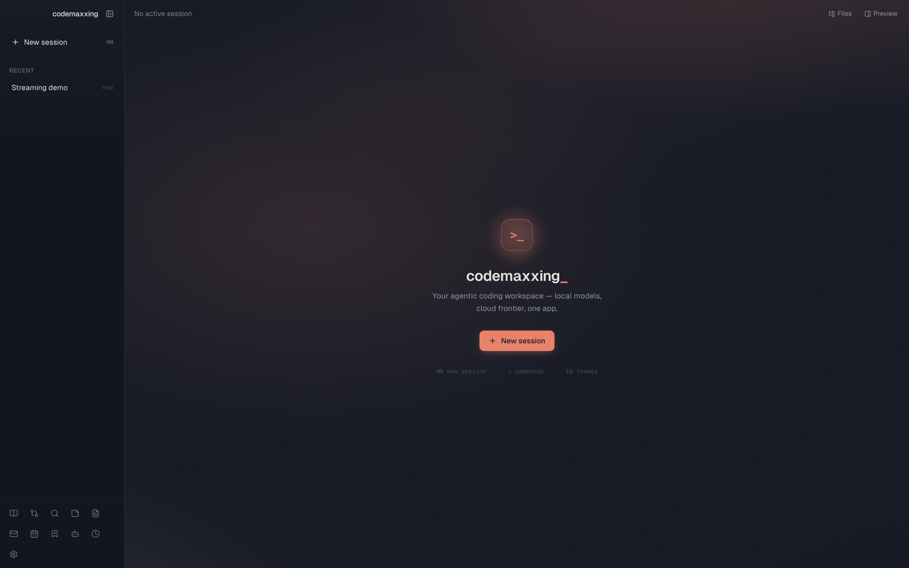
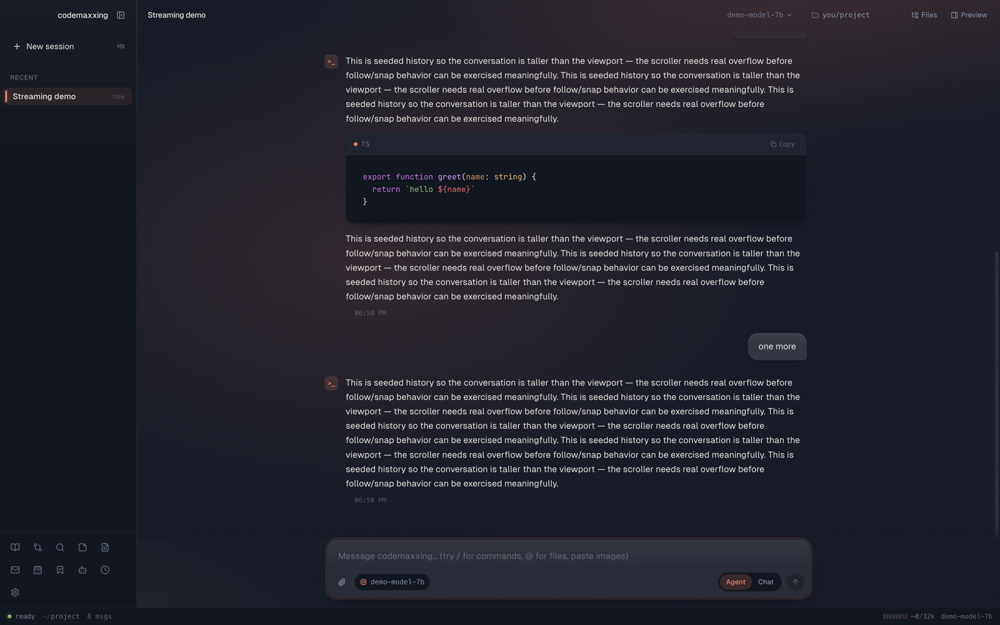
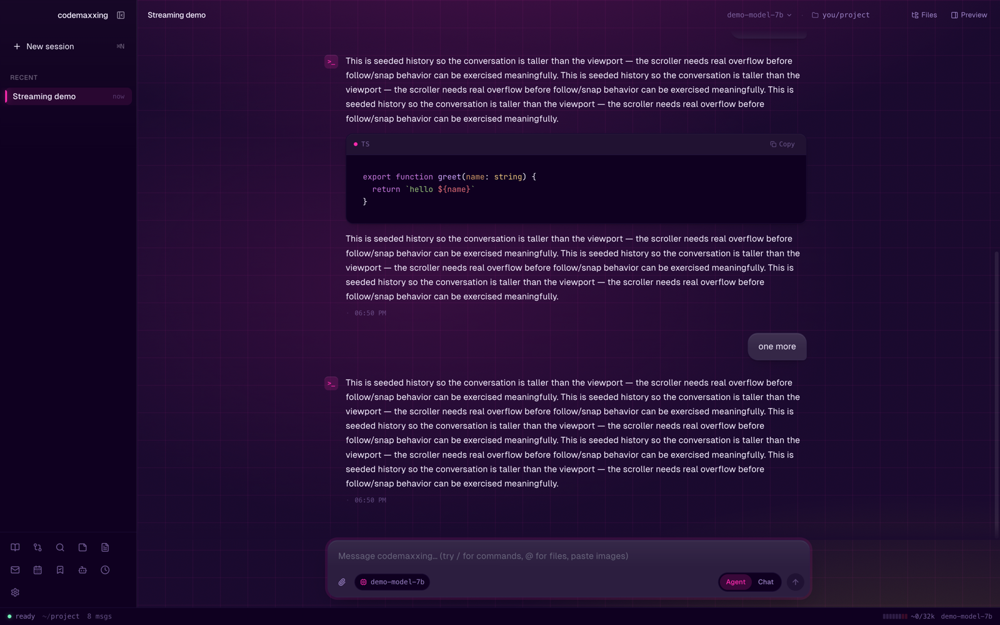
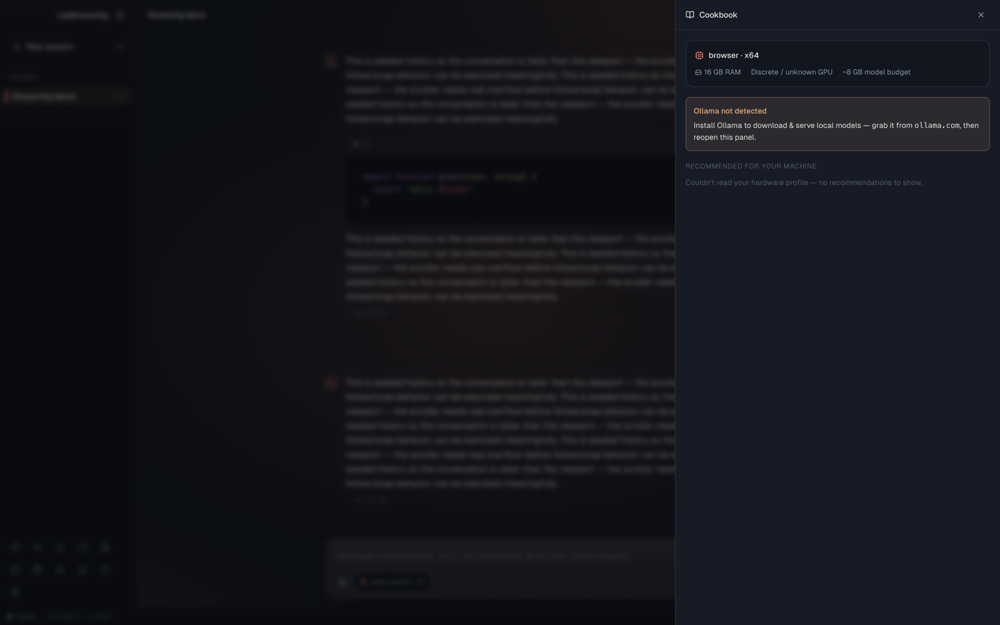

# codemaxxing-desktop 💪

> same agent. native app. every platform.

[](LICENSE)
[](#install)
[](https://github.com/MarcosV6/codemaxxing)

Native desktop app for [codemaxxing](https://github.com/MarcosV6/codemaxxing) — the open-source coding agent. Connect **any** LLM (local or remote), drive a real agent loop, and do it from a polished GUI instead of the terminal. Beta builds target macOS, Windows, and Linux.

> _Looking for the terminal version? It lives at [MarcosV6/codemaxxing](https://github.com/MarcosV6/codemaxxing) — same brain, different surface._

<p align="center">
  
</p>

## Why this exists

Claude Desktop is locked to Anthropic. Codex Desktop is locked to OpenAI. Every other "AI assistant" app either ships you to one provider, or hides the agent loop behind a chat-only UX. The terminal `codemaxxing` solves the lock-in part — but a lot of people want a real GUI: drag-and-drop attachments, a sidebar of sessions, themes, command palette, dock notifications. So here's that.

- **Any LLM.** Anthropic, OpenAI, OpenRouter, Qwen, GitHub Copilot, LM Studio, Ollama — and any custom OpenAI-compatible endpoint.
- **Real agent loop.** Files, shell, git, web search, MCP servers. Plan mode. Approval modes (`suggest` / `auto-edit` / `full-auto`). Reasoning effort tiers.
- **Local-first by default.** Sessions, memory (FTS5 search), checkpoints, and skills all live in a SQLite DB on your machine. API keys are encrypted at rest via the OS keychain.
- **A real workspace, not just chat.** Cookbook (find + run local models), Compare (judge models side-by-side), Deep Research (cited reports), plus Documents, Notes, Email, and Calendar — all theme-aware.
- **Talk to it from anywhere.** A built-in HTTP+SSE remote API server with per-device pairing means a future phone client (or any tool) can drive the agent over your LAN or a tunnel.
- **24/7-friendly.** Optional background mode — close the window, the agent keeps running. Tray icon, launch-at-login, never miss an approval.

## Look & feel

17 built-in themes, each with its own ambient backdrop + film grain. Distinctive typography (Geist + JetBrains Mono), real depth, and a floating composer with an inline Agent/Chat toggle.

<p align="center">
  
</p>

<p align="center">
  
  
</p>

## Install

> **Status:** beta. Every version tag must pass native macOS, Windows, and Linux packaging before its assets are published to [GitHub Releases](https://github.com/MarcosV6/codemaxxing-desktop/releases/latest). The current beta targets Apple Silicon macOS, x64 Windows, and x64 Linux. Installers are not yet Developer ID/Authenticode signed, so the operating system may show a one-time warning.

| Platform | Download from GitHub Releases | Build locally |
|---|---|---|
| macOS 12+, Apple Silicon | `Codemaxxing-<version>-arm64-mac.zip` | `npm run electron:build:mac` |
| Windows 10/11, x64 | `Codemaxxing.Setup.<version>.exe` or `*-win.zip` | `npm run electron:build:win` |
| Linux, x64 | `*.AppImage`, `*.deb`, or `*.tar.gz` | `npm run electron:build:linux` |

### macOS

Download the newest `Codemaxxing-<version>-arm64-mac.zip` from the [latest release](https://github.com/MarcosV6/codemaxxing-desktop/releases/latest).

> Apple Silicon (M1–M4) only for now. Intel builds will return once we set up CI for them.

#### One-liner install (Terminal)

The fastest path — handles download, unzip, drop into `/Applications`, and removes the quarantine flag so Gatekeeper doesn't block it:

```bash
bash <(curl -fsSL https://raw.githubusercontent.com/MarcosV6/codemaxxing-desktop/main/install-mac.sh)
```

Then launch from Applications. Done.

#### Manual install (no Terminal)

1. Download the zip for your Mac (links above).
2. Unzip it. Drag **Codemaxxing.app** into your **Applications** folder.
3. Double-click the app → macOS will say _"Apple could not verify…"_ → click **Done**.
4. Open **System Settings → Privacy & Security → scroll to the bottom**.
5. You'll see _"Codemaxxing was blocked to protect your Mac"_ → click **Open Anyway**.
6. Confirm with Touch ID or password.
7. App opens. Future launches won't show the warning.

> **Why?** The beta is ad-hoc signed but not Apple-notarized yet. The warning is a one-time approval for a build you deliberately downloaded.

### Windows

From the [latest release](https://github.com/MarcosV6/codemaxxing-desktop/releases/latest), download either:

- `Codemaxxing.Setup.<version>.exe` for the normal installer, or
- `Codemaxxing-<version>-win.zip` for a portable copy.

Unsigned beta builds may show **Windows protected your PC**. Choose **More info → Run anyway** after confirming the download came from this repository.

### Linux

Download the AppImage from the [latest release](https://github.com/MarcosV6/codemaxxing-desktop/releases/latest), then:

```sh
chmod +x Codemaxxing-*.AppImage
./Codemaxxing-*.AppImage
```

Debian/Ubuntu users can instead install the `.deb`; a portable `.tar.gz` is also attached.

### From the shell

Requires Node.js 22+, npm 10+, and Git:

```sh
git clone https://github.com/MarcosV6/codemaxxing-desktop.git
cd codemaxxing-desktop
npm ci
npm run electron:dev
```

To package the app, replace the last command with the matching `npm run electron:build:mac`, `npm run electron:build:win`, or `npm run electron:build:linux`. Output is written to `release/`.

To update an existing clone:

```sh
git pull --ff-only origin main
npm ci
npm run electron:dev
```

See [Building from source](docs/BUILDING.md) for platform prerequisites, packaging details, troubleshooting, and the native smoke-test checklist.

## Quick start

1. Launch Codemaxxing.
2. **Settings → Providers** → add an API key, sign in via OAuth, or just start LM Studio / Ollama locally — the app auto-detects them.
3. **New Session** → pick a project directory → pick a model → start chatting.

The first thing to try: drop a file into the chat area. It becomes an `@mention` in your prompt. Works for code files, screenshots, PDFs.

## Features

| | |
|---|---|
| **Agent loop** | files, shell, git, web search, MCP, plan mode, subagents |
| **Workspaces** | Cookbook · Compare · Deep Research · Notes & Tasks · Documents · Email · Calendar — all theme-aware |
| **Agent has eyes** | opens a live Preview and screenshots its own running UI to verify visually before saying "done" |
| **Approval modes** | `suggest` (ask each tool) · `auto-edit` (auto file writes) · `full-auto` (sandboxed dirs only) |
| **Reasoning** | per-session effort: off / low / medium / high / max — for models that support extended thinking |
| **Sessions** | persistent SQLite, cross-session search, fork-and-compact, checkpoints |
| **Memory** | FTS5-backed long-term memory, per-project scoping, `/memory` slash command |
| **Skills** | reusable prompts/tools you can `/`-invoke; supports the [agentskills.io](https://agentskills.io) format |
| **Hooks** | `PreToolUse`, `PostToolUse`, `UserPromptSubmit`, `SessionStart`, `SessionEnd` |
| **Background agents** | headless tasks that run while you do something else |
| **Cron** | scheduled tasks with full agent powers (`/cron`) |
| **Resizable layout** | drag-resize + persisted sidebar and side panels |
| **Themes** | 17 built-in, each with its own ambient backdrop + film grain |
| **Slash commands** | `/diff` `/status` `/log` `/commit` `/push` `/undo` `/cost` `/compact` `/checkpoint` `/checkpoints` `/skills` `/think` `/memory` `/bg` `/cron` `/cookbook` `/compare` `/research` `/notes` `/docs` `/email` `/calendar` `/settings` `/help` |
| **Remote API** | HTTP+SSE server with per-device pairing — any client can drive the agent. See [docs/REMOTE_API.md](docs/REMOTE_API.md) |
| **24/7 mode** | keep agent alive when window is closed, launch at login, menubar/tray icon |

## Remote access

The desktop ships an HTTP+SSE API for clients on the same LAN (or routed via Tailscale/Cloudflare Tunnel for off-LAN). Pair a device with a 6-character one-time code; each device gets its own bearer token, revokable individually.

Full wire-protocol docs: **[docs/REMOTE_API.md](docs/REMOTE_API.md)**.

This is the foundation for the upcoming native phone clients. Today you can drive it with `curl`, a PWA, or any HTTP client.

## Stack

- **Electron 43** main + preload, contextBridge IPC, sandboxed renderer
- **React 19** + **TypeScript 5.5** + **Vite 7** renderer
- **Zustand 5** state management
- **Tailwind 3** styling with CSS custom properties for theming
- **SQLite** (`better-sqlite3`) for sessions, memory, checkpoints, background agents, cron
- **Hono** for the remote API server
- **electron-builder** for packaging

## Relationship to the CLI

The terminal version at [`MarcosV6/codemaxxing`](https://github.com/MarcosV6/codemaxxing) is the conceptual source of truth for agent behavior. Today, the desktop has its own port of the agent runtime (it doesn't import from the CLI). Long-term plan: extract a shared `@codemaxxing/core` package both repos depend on. For now, behavior parity is maintained manually — file an issue if you spot drift.

## Contributing

PRs welcome. Read [CONTRIBUTING.md](CONTRIBUTING.md) first — the dev workflow is `npm run electron:dev`, the typecheck must stay clean (`npm run typecheck`), and we don't add emojis to source unless asked.

## Security

If you find a vulnerability, please **don't** open a public issue. See [SECURITY.md](SECURITY.md) for the disclosure process.

The threat model in short: this app holds API keys (in keychain or platform-equivalent), executes shell commands (with user approval), runs an HTTP server when remote access is on, and the paired devices control the agent. It deserves the same care you'd give a remote-administration tool.

## License

MIT — see [LICENSE](LICENSE).

Built by [Marcos Vallejo](https://github.com/MarcosV6).
